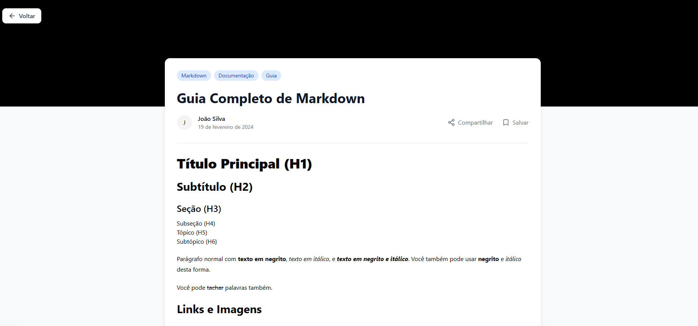

# DevBlog 📝

> ⚠️ **Status: Em Desenvolvimento** - Este projeto está ativamente em desenvolvimento e algumas funcionalidades podem estar incompletas ou sujeitas a mudanças.

Um blog moderno e interativo para desenvolvedores compartilharem conhecimento, construído com Next.js 15, TypeScript, e Tailwind CSS.



## ✨ Funcionalidades

- 🚀 **Performance Otimizada** - Server Components e Static Site Generation
- 📱 **Design Responsivo** - Interface adaptável para todos os dispositivos
- 🎨 **UI Moderna** - Componentes estilizados com Tailwind CSS e shadcn/ui
- 🔍 **SEO Otimizado** - Meta tags dinâmicas e URLs amigáveis
- 📝 **Markdown** - Suporte a renderização de conteúdo em Markdown
- 🔄 **Compartilhamento** - Integração com Web Share API
- 🏷️ **Tags** - Organização e navegação por tags
- 📊 **Tempo de Leitura** - Estimativa automática do tempo de leitura

## 🛠️ Tecnologias

- [Next.js 15](https://nextjs.org/) - Framework React com App Router
- [TypeScript](https://www.typescriptlang.org/) - Tipagem estática
- [Tailwind CSS](https://tailwindcss.com/) - Framework CSS utility-first
- [shadcn/ui](https://ui.shadcn.com/) - Componentes reutilizáveis
- [Lucide Icons](https://lucide.dev/) - Biblioteca de ícones
- [Sonner](https://sonner.emilkowal.ski/) - Notificações toast
- [Markdown-it](https://github.com/markdown-it/markdown-it) - Parser Markdown

## 📁 Estrutura do Projeto

```
src/
├── app/                    # App Router do Next.js
│   ├── layout.tsx         # Layout principal
│   ├── page.tsx           # Página inicial
│   └── posts/             # Rotas de posts
│       └── [slug]/        # Página dinâmica do post
│           ├── page.tsx
│           └── _components/
├── components/            # Componentes reutilizáveis
│   └── ui/               # Componentes base (shadcn/ui)
└── lib/                  # Utilitários e configurações
    └── utils.ts          # Funções utilitárias
```

## 🚀 Começando

### Pré-requisitos

- Node.js 18+
- pnpm (recomendado) ou npm

### Instalação

1. Clone o repositório

```bash
git clone https://github.com/seu-usuario/devblog.git
```

2. Instale as dependências

```bash
pnpm install
```

3. Inicie o servidor de desenvolvimento

```bash
pnpm dev
```

Acesse [http://localhost:3000](http://localhost:3000) no seu navegador.

### Scripts Disponíveis

- `pnpm dev` - Inicia o servidor de desenvolvimento
- `pnpm build` - Gera build de produção
- `pnpm start` - Inicia o servidor de produção
- `pnpm lint` - Executa verificação de linting
- `pnpm test` - Executa testes

## 🤝 Contribuindo

1. Fork o projeto
2. Crie sua Feature Branch (`git checkout -b feature/AmazingFeature`)
3. Commit suas mudanças (`git commit -m 'feat: add amazing feature'`)
4. Push para a Branch (`git push origin feature/AmazingFeature`)
5. Abra um Pull Request

### Convenções de Commit

Seguimos o padrão [Conventional Commits](https://www.conventionalcommits.org/):

- `feat:` - Novas funcionalidades
- `fix:` - Correções de bugs
- `docs:` - Documentação
- `style:` - Formatação de código
- `refactor:` - Refatorações
- `chore:` - Tarefas de manutenção

## 📧 Contato

Link do Projeto: [DevBlog](https://dev-blog-rosy.vercel.app/)

---

⭐️ Se este projeto te ajudou, considere dar uma estrela!
